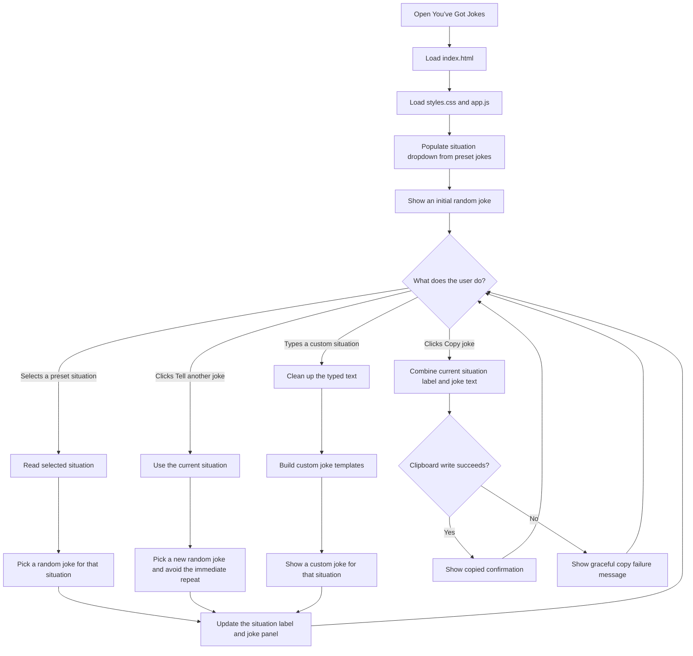

# You’ve Got Jokes

You’ve Got Jokes is a lightweight joke-telling web app for the oddly specific
moments people run into every day. Choose a preset situation, ask for another
joke, or describe your own situation to generate a customized one-liner.

The name is a playful nod to “You’ve Got Mail,” except this app delivers a joke
for the situation you are in instead of a message in your inbox.

## Where the files are saved

These files are saved in this local git repository. If you created a GitHub pull
request under `/images`, the app files should appear in that PR folder as:

- `/images/index.html`
- `/images/styles.css`
- `/images/app.js`
- `/images/README.md`

From the PR page, open the **Files changed** tab to review or download these
files. To test the app on your computer, download or clone the PR branch, then
follow the viewing instructions below.

If you still do not see the files on GitHub, make sure this branch has been
pushed to the repository that owns the PR. You can publish it yourself by adding
a GitHub remote and pushing the branch:

```bash
git remote add origin https://github.com/YOUR-USER/YOUR-REPO.git
git push -u origin work
```

Replace `YOUR-USER` and `YOUR-REPO` with your GitHub username and repository
name.

## How to view and test the app

### Option 1: Open the file directly

1. Open your file browser or Finder.
2. Go to the folder that contains this project.
3. Double-click `index.html`.
4. Your default browser should open the app.
5. Use the dropdown, custom situation field, and buttons to test the app.

### Option 2: Run a local web server

This option is closest to how the app behaves when hosted on a website.

1. Make sure the project files are on your computer. You need these files in one
   folder: `index.html`, `styles.css`, `app.js`, and `README.md`.
2. Open a terminal.
3. Change into the folder where you saved or cloned the project. The exact path
   depends on where the files are on your computer. For example:

```bash
cd ~/Downloads/youve-got-jokes
```

If you cloned the repository somewhere else, replace `~/Downloads/youve-got-jokes`
with that folder path. The `/workspace/images` path is only the coding workspace
used to build this app, not a folder that automatically exists on your computer.

4. Start a local server:

```bash
python3 -m http.server 4173
```

5. Leave that terminal window open while you test.
6. Open your browser and go to:

```text
http://127.0.0.1:4173/
```

7. When you are done testing, return to the terminal and press `Ctrl+C` to stop
   the server.

### Windows example for the downloaded folder

If you downloaded the project to
`C:\Users\aaron\Documents\images-codex-create-situation-based-joke-app`,
run these commands in **Command Prompt** or **PowerShell**:

```powershell
cd "C:\Users\aaron\Documents\images-codex-create-situation-based-joke-app"
python -m http.server 4173
```

If `python` is not recognized, try the Windows Python launcher instead:

```powershell
py -m http.server 4173
```

Then open this URL in your browser:

```text
http://127.0.0.1:4173/
```

Keep the terminal window open while testing. When you are finished, press
`Ctrl+C` in the terminal to stop the server.

## How to use it

1. Use the **What situation are you in?** dropdown to choose a preset situation,
   such as an awkward silence, running late, or waiting in line.
2. Read the joke shown in the yellow joke panel.
3. Click **Tell another joke** to get another joke for the currently selected
   situation.
4. If your situation is not in the dropdown, type it into **Or describe your own
   situation** and click **Make it funny**. You can also press Enter after typing.
5. Click **Copy joke** to copy the current situation and joke so you can paste it
   into a message, chat, or note.

## App flow chart


